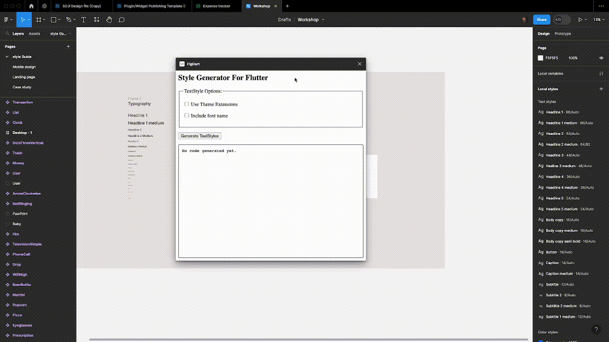
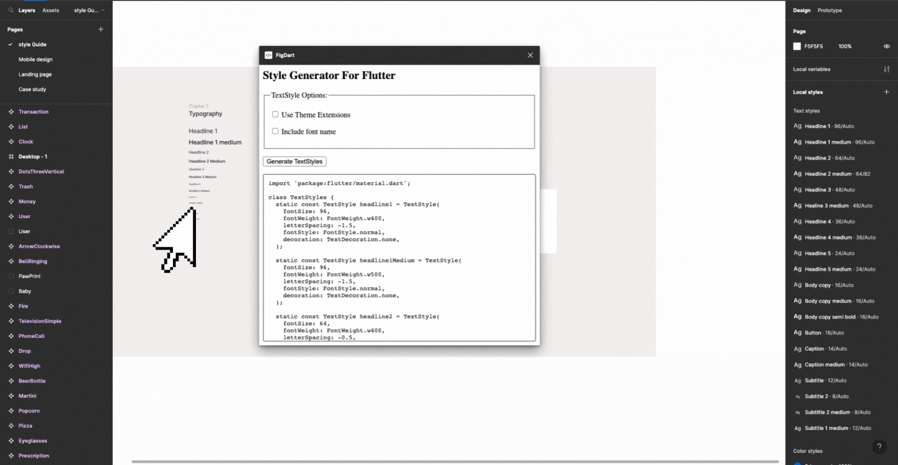
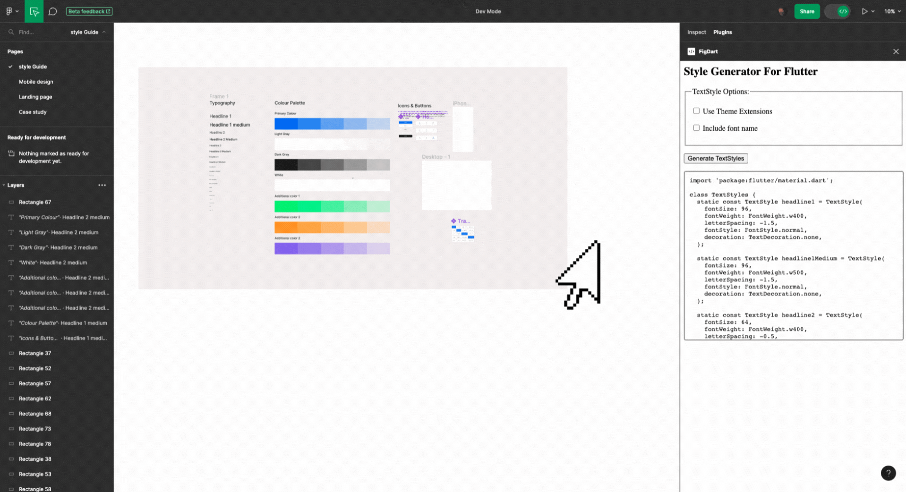
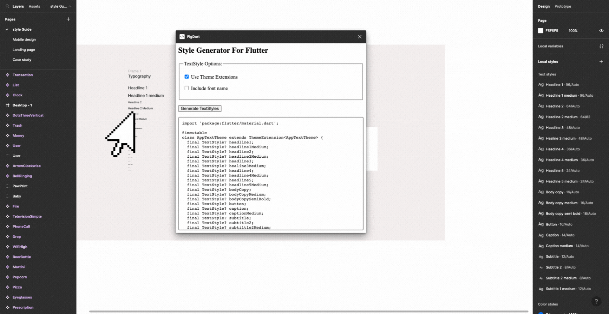
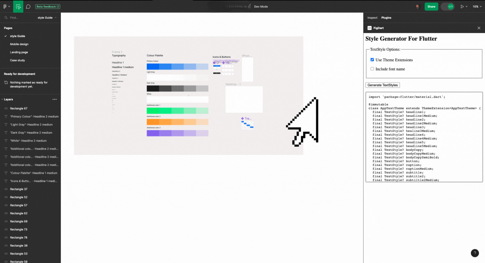
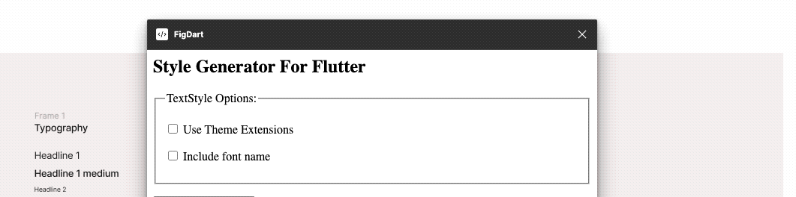

  
  
  
  

  
<h1 align="center">Figma Styles to Flutter</h1>

 

## The Problem

When it comes to translating styles like textstyles and colors, there are a couple of problems that could arise. Some includes:

- Manually converting Figma text styles to Flutter code
- Greater risk of inconsistencies appearing in text styles between the design files and the coded application
- Manually converting styles often results in code duplication
- Manual conversion can lead to errors such as incorrect values, typos, or even omitted styles, which can be costly to debug and fix
- Every time a designer updates a text style in Figma, developers have to manually update the corresponding code, which is both time-consuming and error-prone

## Solution

By automating the conversion process, FigDart aims to eliminate these issues, making the design-to-code workflow more efficient, accurate, and consistent.

### Editor Mode

### Dev Mode on View Only Access

## Further features

### Use Theme Extensions

You may choose to register your textstyles as a theme extension.

### Editor Mode

### Dev Mode on View Only Access

### Vary textstyle properties

You may select some other textstyle properties like font family

TODO:
- [ ] Text decoration
- [ ] letter spacing
- [ ] line height.

